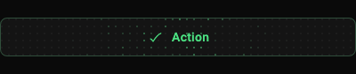
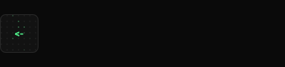
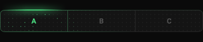
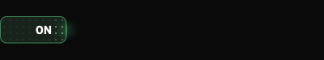
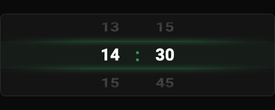
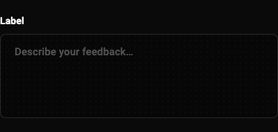
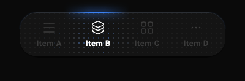
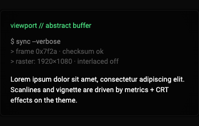
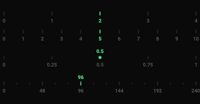
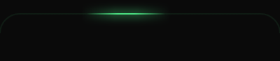

# termos_ui

Maximalist Flutter UI component library with dot-grid mesh, starfield particles, and CRT-style effects. Provides themed, accessible widgets with a terminal-inspired visual identity.

## Quick start

```dart
import 'package:termos_ui/termos_ui.dart';

// Wrap your app (or subtree) with TermosTheme:
TermosTheme(
  data: TermosThemeData.dark(),
  child: MyApp(),
)

// Or register as a ThemeExtension on MaterialApp's ThemeData:
ThemeData(
  extensions: [TermosThemeData.dark()],
)
```

Widgets resolve the theme via `TermosTheme.of(context)`, which checks the `TermosTheme` InheritedWidget first, then falls back to `Theme.of(context).extension<TermosThemeData>()`, then to a brightness-based default.

## Architecture

```
lib/
├── core/           # Dot grid system, tap target, alignment
├── painters/       # CustomPainters (starfield, scanlines, glow borders)
├── theme/          # Design tokens: colors, text styles, metrics, effects
└── widgets/        # Composable UI controls
```

### Theme tokens

| Token class | Purpose |
|---|---|
| `TermosColors` | Semantic palette (primary, surface, text levels, status colors) |
| `TermosTextStyles` | Typography roles (terminal header, nav label, code, body, section title, switch label, time picker) |
| `TermosMetrics` | Layout: radii, heights, paddings, animation durations |
| `DotGridConfig` | Dot grid geometry (dot size, spacing, blob radius) |
| `TermosStarfieldConfig` | Starfield glow positions and intensities |
| `TermosNavBarEffects` | Nav bar dot grid, glow, and selection tuning |
| `TermosSegmentedEffects` | Segmented selector glow blending |
| `TermosButtonEffects` | Button card blend and border state mixing |
| `TermosCrtEffects` | CRT bezel, shadows, vignette |
| `TermosTimePickerEffects` | Time picker band, scanlines, colon pulse, font sizes |

`TermosThemeData` aggregates all tokens and supports `copyWith`, `lerp` (for animated theme transitions), and light/dark factory constructors.

### Widgets

| Widget | Description |
|---|---|
| `TermosButton` | Primary CTA with dot-grid mesh and starfield; loading/saved states with typing animation |
| `TermosBackButton` | Compact back control with starfield |
| `TermosNavBar` | Bottom tab bar with animated top-edge glow and page-controller sync |
| `TermosSegmentedSelector` | Horizontal segments with glow and starfield |
| `TermosSlider` | Discrete tick strip (delegates to `TermosFloatingSlider`) |
| `TermosFloatingSlider` | Draggable discrete slider with morphing indicator |
| `TermosContinuousSlider` | Continuous-value slider with floating label |
| `TermosDetailedSlider` | Major ticks + subdivision dots with snap and morph |
| `TermosSwitch` | Particle-style ON/OFF toggle |
| `TermosTextField` | Text input with dot-grid, edge glow, vertical starfield on focus |
| `TermosTimePicker` | Drum wheel picker with CRT band and scanlines |
| `TermosCrt` | CRT wrapper: scanlines, vignette, bezel |
| `TermosLoadingIndicator` | Small spinner or large comet orbit animation |
| `TermosGroup` | Dot-grid alignment group for coordinated mesh effects |

Full constructor parameters for the widgets and painters used in `example/lib/main.dart` are listed under [Gallery reference](#gallery-reference) in the Example section.

### Core

| Component | Purpose |
|---|---|
| `DotGridWidget` | Layered dot mesh with ripple, hover, and programmatic triggers |
| `DotGridController` | Programmatic selection and trigger API for `DotGridWidget` |
| `DotGridGroup` | InheritedWidget for shared grid origin across widgets |
| `TermosTapTarget` | Dot-grid tap feedback (replaces Material ripple when heavy effects are on) |
| `TermosAlignedBuilder` | Provides offset relative to `DotGridGroup` for aligned painters |

### How decorations render

`DotGridPainter` is a `CustomPainter` that lays out dots on a regular rectangular lattice and draws the entire background grid in a single `Canvas.drawRawPoints`. Touch and selection decorations are not separate layers or shaders: for each dot inside the influence radius, per-dot color is computed via smoothstep radial falloff and merged with `Color.lerp`, then only the affected dots are overdrawn individually with `Canvas.drawRect`.

Each pointer gets its own `AnimationController` backed by the widget's `TickerProvider`. While the finger is down the animation value stays constant, producing a filled blob; on release a `CurvedAnimation` (`Curves.easeOut`) drives the value upward over `decayDuration`, expanding the blob into a ring that fades out. Each tick calls `setState`, which rebuilds the `CustomPaint` with updated touch data so only one painter handles both static and animated states.

### Heavy effects toggle

Set `TermosThemeData.heavyEffectsEnabled = false` to disable dot-grid mesh, starfield particles, and CRT overlays. Widgets fall back to simpler Material-style visuals with the same layout and colors.

## Accessibility

All interactive widgets expose `Semantics` for screen readers:
- Buttons (`TermosButton`, `TermosBackButton`): `button` role with label
- Toggle (`TermosSwitch`): `toggled` state
- Navigation (`TermosNavBar` items): `selected` state and label
- Segments (`TermosSegmentedSelector`): `selected` state and label
- Sliders: `slider` role with current value
- Time picker: labeled with current time value

## Example

Run the widget gallery / theme configurator:

```bash
cd example
flutter run
```

### Gallery reference

The example app demonstrates the widgets and painters below. Parameters are the public constructor fields (optional parameters show their defaults where the API defines them).

GIF previews below illustrate the widgets and painters that have gallery captures.

#### GlobalKey usage (alignment internals)

These types **manage their own `GlobalKey` instances internally** (you do not pass keys for this). They rely on keys for layout measurement and for computing positions inside a `DotGridGroup`. Avoid swapping them with widgets that assume a fixed number of `Element` children, and expect extra `KeyedSubtree` layers if you inspect the tree:

| Type | Notes |
|---|---|
| `DotGridGroup` | Creates a key on a `KeyedSubtree` around `child`; exposed to descendants via `DotGridGroup.maybeOf` for grid origin. |
| `DotGridWidget` | Uses internal keys for the child and paint layers. |
| `TermosAlignedBuilder` | Uses an internal key to compute `localToGlobal` offset vs the nearest `DotGridGroup`. |

`TermosGroup` is a thin wrapper around `DotGridGroup` (same behavior). Several themed widgets compose `DotGridWidget` and/or `TermosAlignedBuilder` (for example `TermosTextField`, `TermosButton`, `TermosBackButton`); the same considerations apply when debugging layout.

#### `TermosTheme`

| Parameter | Type | Required | Description |
|---|---|:---:|---|
| `key` | `Key?` | | Standard widget key. |
| `data` | `TermosThemeData` | ✓ | Theme tokens for descendants. |
| `child` | `Widget` | ✓ | Subtree that reads `TermosTheme.of(context)`. |

#### `TermosThemeData` (passed as `TermosTheme.data`)

Used throughout the example to configure colors, metrics, and effects. Constructor parameters:

| Parameter | Type | Default | Description |
|---|---|---|---|
| `colors` | `TermosColors` | (required) | Semantic palette. |
| `dotGrid` | `DotGridConfig` | (required) | Dot geometry. |
| `textStyles` | `TermosTextStyles` | (required) | Typography. |
| `metrics` | `TermosMetrics` | `TermosMetrics.standard` | Layout radii, heights, durations, etc. |
| `starfield` | `TermosStarfieldConfig` | `TermosStarfieldConfig()` | Starfield tuning. |
| `navBar` | `TermosNavBarEffects` | `TermosNavBarEffects()` | Nav bar glow/starfield. |
| `segmented` | `TermosSegmentedEffects` | `TermosSegmentedEffects()` | Segmented control glow. |
| `button` | `TermosButtonEffects` | `TermosButtonEffects()` | Button border blends. |
| `crt` | `TermosCrtEffects` | `TermosCrtEffects()` | CRT bezel/shadows. |
| `timePicker` | `TermosTimePickerEffects` | `TermosTimePickerEffects()` | Time picker band/scanlines. |
| `heavyEffectsEnabled` | `bool` | `true` | When `false`, heavy dot grid/starfield/CRT are reduced. |

Factories: `TermosThemeData.dark()`, `TermosThemeData.light()`, `TermosThemeData.fallbackBrightness(Brightness)`.

#### `TermosButton`



| Parameter | Type | Default | Description |
|---|---|---|---|
| `key` | `Key?` | | |
| `label` | `Text` | ✓ | Button label. |
| `onTap` | `VoidCallback?` | | |
| `icon` | `Widget?` | | Optional leading icon; tinted for state ([BlendMode.srcIn]). Use a monochrome glyph (e.g. white) for correct disabled/saved coloring. |
| `enabled` | `bool` | `true` | |
| `isLoading` | `bool` | `false` | |
| `loadingLabel` | `String?` | | |
| `typingLoadingTransition` | `bool` | `false` | |
| `savedState` | `bool` | `false` | |
| `allowTapWhenSaved` | `bool` | `false` | |
| `savedLabel` | `String?` | | |
| `savedIcon` | `Widget?` | | Same tinting rules as `icon`. |
| `height` | `double?` | | |
| `width` | `double?` | | |
| `expandWidth` | `bool` | `true` | Fill horizontal space when `true`. |
| `color` | `Color?` | | |
| `borderRadius` | `BorderRadius?` | | |

#### `TermosBackButton`



| Parameter | Type | Default | Description |
|---|---|---|---|
| `key` | `Key?` | | |
| `onTap` | `VoidCallback` | ✓ | |
| `size` | `double?` | | Defaults to `TermosMetrics.backButtonDefaultSize`. |
| `label` | `String?` | | Defaults to `TermosMetrics.backButtonGlyph`. |

#### `TermosLoadingIndicator`


| Parameter | Type | Default | Description |
|---|---|---|---|
| `key` | `Key?` | | |
| `size` | `double` | `24` | Below ~80px uses `CircularProgressIndicator`; comet above. |
| `color` | `Color?` | | |
| `backgroundColor` | `Color?` | | |
| `excludedPersonas` | `Set<LoaderPersona>?` | | Exclude comet personas from random pick. |
| `transitionKey` | `Object?` | | When changed (large sizes), plays exit then remounts enter. |

`LoaderPersona`: `calm`, `energetic`, `energeticRush`, `energeticDance`, `cosmic`, `minimal`, `liked`.

#### `TermosGroup`

| Parameter | Type | Required | Description |
|---|---|:---:|---|
| `key` | `Key?` | | |
| `child` | `Widget` | ✓ | Wrapped in `DotGridGroup` — see **GlobalKey usage** above. |

#### `TermosSegmentedItem`

| Parameter | Type | Required | Description |
|---|---|:---:|---|
| `label` | `String` | ✓ | |
| `icon` | `Widget?` | | Optional; same tint behavior as `TermosButton` icons. |

#### `TermosSegmentedSelector`



| Parameter | Type | Required | Description |
|---|---|:---:|---|
| `key` | `Key?` | | |
| `items` | `List<TermosSegmentedItem>` | ✓ | |
| `selectedIndex` | `int` | ✓ | |
| `onSelectionChanged` | `ValueChanged<int>` | ✓ | |

#### `TermosSwitch`



| Parameter | Type | Default | Description |
|---|---|---|---|
| `key` | `Key?` | | |
| `value` | `bool` | ✓ | |
| `onChanged` | `ValueChanged<bool>?` | | |
| `blobRadius` | `double` | `21.5` | |
| `edgeSharpness` | `double` | `5` | |
| `glowIntensity` | `double` | `0.5` | |
| `dotSize` | `double?` | | Uses theme dot size when null. |
| `gridSpacing` | `double?` | | Uses theme spacing when null. |
| `blobInset` | `double` | `8` | |
| `onAlpha` | `double` | `1` | |
| `offAlpha` | `double` | `0.23` | |
| `idleAlpha` | `double` | `0.05` | |
| `sweepWeight` | `double` | `0` | |
| `blobWeight` | `double` | `1` | |
| `trackWidth` | `double` | `82` | |
| `trackHeight` | `double` | `33.5` | |
| `trackRadius` | `double?` | | Uses `TermosMetrics.borderRadius` when null. |
| `borderWidth` | `double` | `1` | |
| `glowStrokeWidth` | `double` | `1` | |

#### `TermosTimePicker`



| Parameter | Type | Default | Description |
|---|---|---|---|
| `key` | `Key?` | | |
| `time` | `TimeOfDay` | ✓ | |
| `onTimeChanged` | `ValueChanged<TimeOfDay>` | ✓ | |
| `commitDebounce` | `Duration?` | | Debounce before firing `onTimeChanged`. |
| `minuteStep` | `int` | `15` | Must divide 60 evenly. |

#### `TermosTextField`



| Parameter | Type | Default | Description |
|---|---|---|---|
| `key` | `Key?` | | |
| `label` | `String?` | | |
| `controller` | `TextEditingController` | ✓ | |
| `focusNode` | `FocusNode?` | | |
| `hintText` | `String?` | | |
| `textFieldStyle` | `TermosTextFieldStyle` | `TermosTextFieldStyle.code` | `code` or `prose`. |
| `style` | `TextStyle?` | | Overrides field text style. |
| `hintStyle` | `TextStyle?` | | |
| `maxLines` | `int` | `1` | |
| `minLines` | `int?` | | |
| `autofocus` | `bool` | `false` | |
| `enabled` | `bool` | `true` | |
| `readOnly` | `bool` | `false` | |
| `obscureText` | `bool` | `false` | |
| `onChanged` | `ValueChanged<String>?` | | |
| `onSubmitted` | `ValueChanged<String>?` | | |
| `textInputAction` | `TextInputAction?` | | |
| `keyboardType` | `TextInputType?` | | |
| `inputFormatters` | `List<TextInputFormatter>?` | | |
| `suffixIcon` | `Widget?` | | |
| `labelSpacing` | `double` | `8` | Gap below label. |

#### `TermosNavBarItem`

| Parameter | Type | Required | Description |
|---|---|:---:|---|
| `icon` | `Widget` | ✓ | Tab glyph; tinted for selected vs muted ([BlendMode.srcIn]). Monochrome on transparent works best. |
| `label` | `String` | ✓ | |
| `color` | `Color` | ✓ | Accent for this tab. |

#### `TermosNavBar`



| Parameter | Type | Required | Description |
|---|---|:---:|---|
| `key` | `Key?` | | |
| `items` | `List<TermosNavBarItem>` | ✓ | |
| `selectedIndex` | `int` | ✓ | |
| `onItemSelected` | `ValueChanged<int>` | ✓ | |
| `pageController` | `PageController?` | | Optional sync with horizontal pager drag. |

#### `TermosCrt`



| Parameter | Type | Default | Description |
|---|---|---|---|
| `key` | `Key?` | | |
| `child` | `Widget` | ✓ | Content inside the CRT viewport. |
| `showOuterEffects` | `bool` | `true` | Outer border and shadow. |

#### `TermosSlider`



| Parameter | Type | Required | Description |
|---|---|:---:|---|
| `key` | `Key?` | | |
| `value` | `double` | ✓ | |
| `start` | `double` | ✓ | Range start. |
| `end` | `double` | ✓ | Range end. |
| `step` | `double` | ✓ | Tick spacing (see `evenStep`). |
| `onChanged` | `ValueChanged<double>` | ✓ | |
| `compact` | `bool` | `true` | |
| `formatValue` | `String Function(double)?` | | Tick label formatter. |

Related API: `TermosSlider.kMaxDiscreteSteps` (10), `TermosSlider.evenStep`, `TermosSlider.snap`, `TermosSlider.discreteValues`, `TermosSlider.defaultFormatValue`.

#### `TermosFloatingSlider`

| Parameter | Type | Default | Description |
|---|---|---|---|
| `key` | `Key?` | | |
| `value` | `double` | ✓ | |
| `min` | `double` | ✓ | |
| `max` | `double` | ✓ | |
| `onChanged` | `ValueChanged<double>` | ✓ | |
| `divisions` | `int?` | | Intervals; positions = divisions + 1. |
| `compact` | `bool` | `true` | |
| `formatValue` | `String Function(double)?` | | |
| `minLabel` | `String?` | | First tick label override. |
| `maxLabel` | `String?` | | Last tick label override. |

Constant: `TermosFloatingSlider.edgePad` (8).

#### `TermosContinuousSlider`

| Parameter | Type | Default | Description |
|---|---|---|---|
| `key` | `Key?` | | |
| `value` | `double` | ✓ | |
| `min` | `double` | ✓ | |
| `max` | `double` | ✓ | |
| `onChanged` | `ValueChanged<double>` | ✓ | |
| `divisions` | `int?` | | Reference ticks (optional). |
| `compact` | `bool` | `true` | |
| `formatValue` | `String Function(double)?` | | |
| `minLabel` | `String?` | | |
| `maxLabel` | `String?` | | |

#### `TermosDetailedSlider`

| Parameter | Type | Default | Description |
|---|---|---|---|
| `key` | `Key?` | | |
| `value` | `double` | ✓ | |
| `min` | `double` | ✓ | |
| `max` | `double` | ✓ | |
| `onChanged` | `ValueChanged<double>` | ✓ | |
| `divisions` | `int?` | | Major labelled ticks. |
| `subdivisions` | `int` | `1` | Dots between major ticks. |
| `compact` | `bool` | `true` | |
| `formatValue` | `String Function(double)?` | | |
| `minLabel` | `String?` | | |
| `maxLabel` | `String?` | | |

#### `DotGridWidget`

| Parameter | Type | Default | Description |
|---|---|---|---|
| `key` | `Key?` | | |
| `child` | `Widget` | ✓ | |
| `controller` | `DotGridController?` | | Programmatic triggers/selection. |
| `dotSize` | `double` | `4.0` | |
| `gridSpacing` | `double` | `6.0` | |
| `primaryColor` | `Color` | `Colors.blue` | |
| `backgroundColor` | `Color` | `Colors.white` | |
| `dotPattern` | `List<int>` | `[1, 5]` | |
| `expansionDuration` | `Duration` | `200ms` | |
| `decayDuration` | `Duration` | `400ms` | |
| `blobRadius` | `double` | `100.0` | |
| `gradientColors` | `List<Color>` | `[]` | |
| `hoverOpacity` | `double` | `1.0` | |
| `enableHoverEffect` | `bool` | `true` | |
| `enabled` | `bool` | `true` | |
| `interactiveMesh` | `bool` | `true` | Pointer response; grid still paints if `false`. |

See **GlobalKey usage** above.

#### `GlowTopBorderPainter` (`CustomPainter`)



| Parameter | Type | Default | Description |
|---|---|---|---|
| `position` | `double` | ✓ | Glow center along top edge, 0–1. |
| `glowColor` | `Color` | ✓ | |
| `baseColor` | `Color` | ✓ | |
| `strokeWidth` | `double` | ✓ | |
| `radius` | `double` | ✓ | Corner radius of the path. |
| `opacity` | `double` | `1.0` | |

#### `ReactiveStarfieldPainter` (`CustomPainter`)


| Parameter | Type | Default | Description |
|---|---|---|---|
| `dotSize` | `double` | ✓ | |
| `gridSpacing` | `double` | ✓ | |
| `glowPosition` | `double` | ✓ | 0–1 spotlight position. |
| `glowColor` | `Color` | ✓ | |
| `intensity` | `double` | `1.0` | |
| `gridOffset` | `Offset` | `Offset.zero` | Align with `DotGridGroup`. |
| `glowRadiusFraction` | `double?` | | |
| `seed` | `int?` | | Random seed for dot pattern. |
| `selectionPoints` | `List<SelectionPoint>?` | | |
| `selectionBlobRadius` | `double?` | | |

#### `ScanlinesPainter` (`CustomPainter`)

| Parameter | Type | Default | Description |
|---|---|---|---|
| `opacity` | `double` | `0.06` | Line alpha. |
