# termos_ui

[](https://pub.dev/packages/termos_ui)

Maximalist Flutter widgets with a terminal-inspired look: an interactive **dot-grid mesh** that ripples under your finger, **starfield** glow, and **CRT scanlines** — wired into a themeable set of buttons, sliders, nav bars, and inputs.

This is the official visual language of [Terminaster](https://pomisoft.dev/terminaster) (turn real commands into cards you'll actually remember) and [Sink In](https://pomisoft.dev/sink-in) (phrasal verbs that sink in) by [Pomisoft](https://pomisoft.dev).

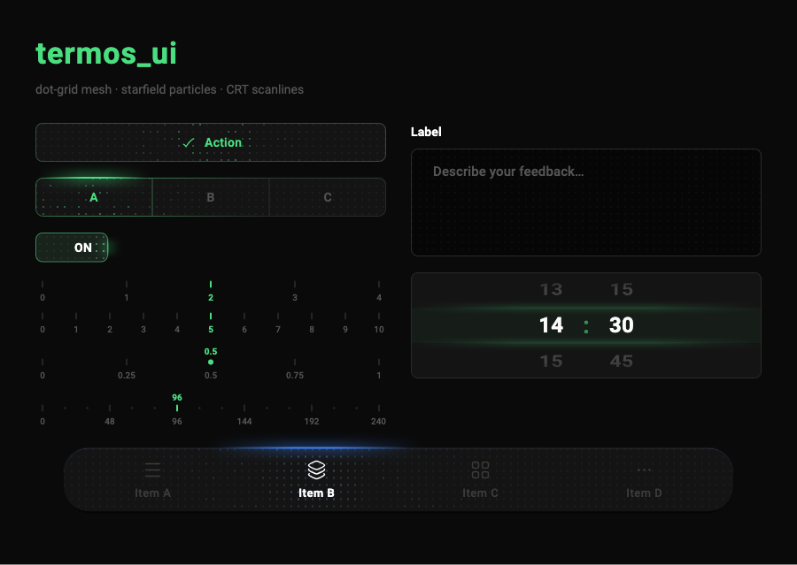

> ⚠️ Not ready for production use — the API is still settling and may change between releases.

## Install

```bash
flutter pub add termos_ui
```

## Quick start

Wrap your app (or any subtree) in a `TermosTheme`, then use the widgets:

```dart
import 'package:flutter/material.dart';
import 'package:termos_ui/termos_ui.dart';

void main() => runApp(const MyApp());

class MyApp extends StatelessWidget {
  const MyApp({super.key});

  @override
  Widget build(BuildContext context) {
    return MaterialApp(
      home: TermosTheme(
        data: TermosThemeData.dark(),
        child: Scaffold(
          body: Center(
            child: TermosButton(
              label: const Text('Action'),
              onTap: () {},
            ),
          ),
        ),
      ),
    );
  }
}
```

Prefer Material's theming? Register `TermosThemeData` as a `ThemeExtension` instead:

```dart
MaterialApp(
  theme: ThemeData(extensions: [TermosThemeData.dark()]),
  home: ...,
)
```

Widgets resolve the theme via `TermosTheme.of(context)`, which checks the `TermosTheme`
inherited widget first, then the `ThemeData` extension, then a brightness-based default.
Factories: `TermosThemeData.dark()`, `TermosThemeData.light()`.

## Widgets

| Widget | What it does |
|---|---|
| `TermosButton` | Primary CTA with dot-grid mesh and starfield; loading/saved states |
| `TermosBackButton` | Compact back control with starfield |
| `TermosNavBar` | Bottom tab bar with animated top-edge glow and `PageController` sync |
| `TermosTabBar` | Scrollable top tabs with a swipe-tracking glow |
| `TermosSegmentedSelector` | Horizontal segments with glow and starfield |
| `TermosSwitch` | Particle-style ON/OFF toggle |
| `TermosSlider` · `TermosFloatingSlider` · `TermosContinuousSlider` · `TermosDetailedSlider` | Discrete, floating-label, continuous, and major/minor-tick sliders |
| `TermosTextField` | Text input with dot-grid, edge glow, and focus starfield |
| `TermosTimePicker` | Drum-wheel picker with CRT band and scanlines |
| `TermosExpandableSection` | Tap-to-expand card |
| `TermosLoadingIndicator` | Small spinner or large comet-orbit animation |
| `TermosCrt` | CRT wrapper: scanlines, vignette, bezel |

Lower-level building blocks are exported too: `DotGridWidget`/`DotGridController`/`DotGridGroup`
(the mesh engine), `TermosTapTarget` (dot-grid tap feedback), and the painters
`ReactiveStarfieldPainter`, `GlowTopBorderPainter`, `ScanlinesPainter`, and `EdgeGlowPainter`.

Every widget's constructor is documented inline — see the source or your IDE's autocomplete for
the full parameter list.

### Gallery

| | | |
|:--:|:--:|:--:|
| 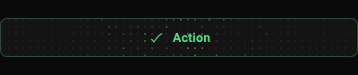 | 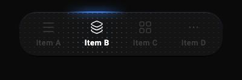 | 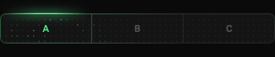 |
| **Button** | **Nav bar** | **Segmented** |
| 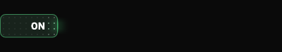 | 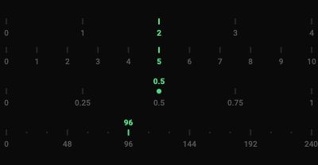 | 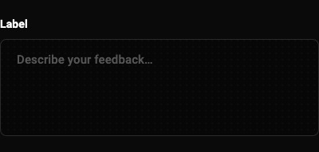 |
| **Switch** | **Sliders** | **Text field** |
| 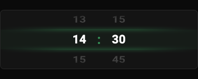 | 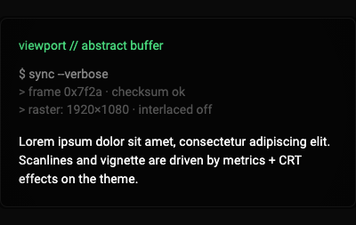 | 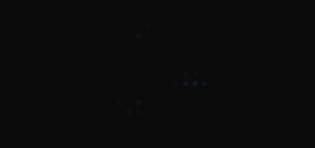 |
| **Time picker** | **CRT** | **Loader** |

### Usage examples

`TermosNavBar` in a real app — the top-edge glow tracks the selected tab:

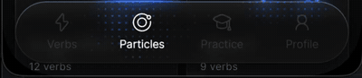

## Theming

`TermosThemeData` aggregates design tokens and supports `copyWith` and `lerp` (for animated
theme transitions):

| Token | Controls |
|---|---|
| `TermosColors` | Semantic palette (primary, surface, text levels, status colors) |
| `TermosTextStyles` | Typography roles |
| `TermosMetrics` | Radii, heights, paddings, durations |
| `DotGridConfig` | Dot size, spacing, blob radius |
| `TermosStarfieldConfig` | Starfield glow positions and intensity |
| Effect configs | Per-widget tuning: `TermosNavBarEffects`, `TermosButtonEffects`, `TermosCrtEffects`, … |

**Lighter visuals:** set `heavyEffectsEnabled: false` to drop the dot-grid mesh, starfield, and
CRT overlays. Widgets fall back to simpler Material-style visuals with the same layout and colors.

## Accessibility

All interactive widgets expose `Semantics` for screen readers — `button` roles with labels,
`toggled` state on the switch, `selected` state on nav/segments, `slider` roles with current
value, and a labelled time picker.

## Example

A full interactive gallery with live theme/color controls lives in [`example/`](example/):

```bash
cd example
flutter run
```

## License

See [LICENSE](LICENSE).
